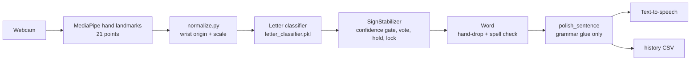

# ASL to Speech — Fingerspelling Translator

A desktop program that watches your webcam, recognizes **American Sign Language fingerspelling** letters, builds them into words and a cleaned-up sentence, and **speaks it out loud**. It runs entirely on your own computer (Windows, macOS, Linux, Raspberry Pi). Nothing is uploaded and no video is saved.

> **What it does not do:** it doesn't translate all of ASL. It recognizes the **24 static fingerspelling letters** (A–Y except J and Z, which need motion). Whole-word signs, facial expressions and body movement are **not** recognized. You spell words letter by letter.


<!-- Add a screenshot or GIF of translator.py running here -->

## Features

| Feature | What it does |
|---|---|
| Live hand tracking | MediaPipe draws your hand skeleton on the video in real time |
| Letter recognition + confidence | Shows e.g. `H  94% confidence` for every prediction |
| "Uncertain — please sign again" | Shown when confidence is below the threshold; those frames never add letters |
| Adjustable threshold | `+` / `-` while running, or `confidence_threshold` in `ml/config.json` |
| Smoothing / debouncing | Majority vote over recent frames, a short hold timer and a repeat lock: holding H adds **one** H, not dozens |
| Double letters | Relax or drop your hand between them (the LL in HELLO) |
| Automatic words | Drop your hand ~0.45 s → the word finishes, is spell-checked (only one-letter slips are fixed) and spoken |
| Automatic sentences | Hand down ~2.5 s (or ENTER) → sentence is cleaned up, spoken and saved |
| Raw vs. processed | Screen always shows `RAW: I GO STORE` and `TEXT: I am going to the store.` |
| Grammar cleanup, never invents signs | Only adds glue words ("am", "are", "to the"), capitals and punctuation; every signed word stays |
| Speech | Offline text-to-speech (pyttsx3); adjustable speed and volume; replay (`r`); speak now (`s`) |
| Readiness indicators | Always-on `Camera / Hand / Light` checks; warns when it's too dark or two hands are seen — never blocks you |
| Pause / clear / backspace | `p`, `c`, BACKSPACE |
| History | Text-only log in `docs/translation_history.csv` (timestamp, raw, sentence) |
| Friendly errors | Plain explanations for no camera, camera in use, missing/incompatible model, no speech engine; one bad frame never crashes it |
| Raspberry Pi mode | Headless (no window), Pi camera support, optional GPIO clear button, beep feedback |

## How it works



Using hand landmarks (not raw images) makes recognition fast (well under 1 ms per prediction) and independent of where your hand is or how far it is from the camera.

## Project layout

```text
ml/
  translator.py      live translator (run this)
  pipeline.py        smoothing + sentence cleanup (no camera needed, unit-tested)
  normalize.py       landmark normalization shared by training and live use
  mp_setup.py        MediaPipe hand-landmarker setup
  paths.py           file locations (scripts work from any folder)
  collect_data.py    record your own training samples
  process_dataset.py / augment_landmarks.py   build/augment the dataset
  train_model.py     train, compare models, save best + metrics
  train_export.py    export model + metrics as JSON
  speak_worker.py    Windows speech helper
  config.json        all settings
  tests/             automated tests
data/landmarks.csv   training data (5,315 samples, 24 letters)
models/              letter_classifier.pkl, hand_landmarker.task
docs/                metrics, history, notes
```

## Install

Python 3.9–3.12 recommended.

```sh
git clone https://github.com/TDS360/ASLtoSpeech
cd ASLtoSpeech
python -m venv .venv
# Windows: .venv\Scripts\activate    macOS/Linux: source .venv/bin/activate
pip install -r ml/requirements.txt
```

Linux also needs a speech engine: `sudo apt install espeak-ng`.

## Run

```sh
python ml/train_model.py     # first time, or if the model won't load
python ml/translator.py
```

Keys: `SPACE` finish word · `ENTER` finish sentence · `BACKSPACE` delete · `p` pause · `r` replay · `s` speak · `c` clear · `+`/`-` threshold · `h` help · `q` quit.

**Example:** spell H‑E‑L‑L‑O, drop hand, H‑O‑W, drop, Y‑O‑U, keep hand down → *"Hello, how are you?"*

## Settings (`ml/config.json`)

`confidence_threshold`, `letter_hold_seconds`, `word_pause_seconds`, `sentence_pause_seconds`, `smoothing_frames`, `spell_correct`, `speak_each_word`, `speech_rate`, `speech_volume`, `beep_feedback`, `camera_index`, `camera_width/height`, `headless`, `use_picamera2`, `gpio_button_pin`, `session_log_path`.

When `use_picamera2` is enabled for Raspberry Pi mode, the translator uses a
fullscreen Tkinter touchscreen display that shows only completed, cleaned
sentences. The camera preview and desktop HUD remain available in desktop mode.

## Dataset and training

`data/landmarks.csv` has ~200 samples per letter, 63 numbers each (21 points × x,y,z after normalization). Add your own with `python ml/collect_data.py`, then retrain with `python ml/train_model.py`, which compares Random Forest, SVM, KNN and MLP on a held-out 20% test split and saves the best model plus `docs/model_metrics.json`.

## Testing

```sh
python -m unittest discover -s ml/tests -v
```

Covers: one letter per hold, low confidence never adds letters, single-frame flicker ignored, double letters, spelling HELLO, the sentence examples above, and that normalization ignores hand position/size.

## Measured performance

From `docs/model_metrics.json` (1,063 held-out samples):

| Model | Accuracy | F1 | ms / prediction |
|---|---|---|---|
| MLP (selected) | 100% | 1.00 | 0.10 |
| Random Forest | 100% | 1.00 | 35.6 |
| KNN | 98.8% | 0.99 | 27.3 |
| SVM | 96.8% | 0.96 | 0.40 |

5-fold cross-validation: 99.8% (±0.3). **Caution:** training and test samples come from the same signer and sessions, so real-world accuracy with new people, lighting and cameras will be lower. The full confusion matrix is in the JSON file.

## Limitations

- Fingerspelling only, 24 letters; no J, Z, numbers or word signs.
- One hand is read at a time; facial expressions and movement are ignored.
- Similar handshapes (M/N, U/V, E/S) are the most likely to be confused.
- Needs decent front lighting and a plain background helps.
- Grammar cleanup is simple rules, not full ASL grammar.

## Future improvements

- Motion model (sequences of frames) for J, Z and common word signs.
- Data from many signers for honest real-world accuracy.
- Speech-to-text for the hearing person's reply (two-way conversation).
- Voice selection in the config.

## Accessibility

High-contrast outlined on-screen text, large current-letter display, audio beeps and speech so it can be used without watching the screen, and full keyboard control or fully automatic hands-free use.
